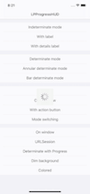
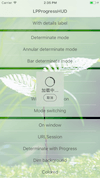
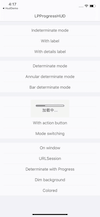
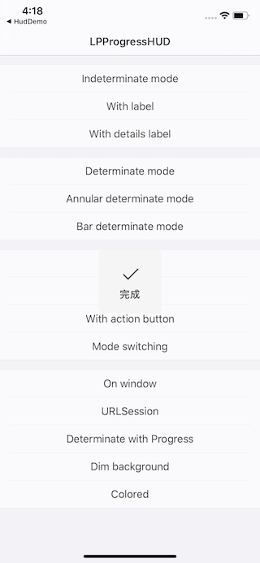
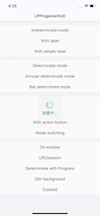

# LPProgressHUD

LPProgressHUD is a Swift version of the HUD that mimics [MBProgressHUD](https://github.com/jdg/MBProgressHUD).










## Requirements

* iOS 8.0+ 
* Xcode 8.1+
* Swift 3.0+

## Installation

### CocoaPods

[CocoaPods](http://cocoapods.org) is a dependency manager for Cocoa projects. You can install it with the following command:

To integrate LPProgressHUD into your Xcode project using CocoaPods, specify it in your Podfile:

```
source 'https://github.com/CocoaPods/Specs.git'
platform :ios, '8.0'
use_frameworks!

target '<Your Target Name>'  do
    pod 'LPProgressHUD', '~> 1.0.0’
end
```

Then, run the following command:

```
$ pod install
```

## Usage
Use MBProgressHUD to set up on the main thread and then switch the task to be performed to the new thread.

```
let hud = LPProgressHUD.show(to: view, animated: true)
DispatchQueue.global().async {
    // Do something...
    DispatchQueue.main.sync {
        hud.hide(animated: true)
    }
}
```

For more examples, including how to use LPProgressHUD with asynchronous operations, take a look at the bundled [Example](Example) project.

## License

This code is distributed under the terms and conditions of the [MIT license](LICENSE).
